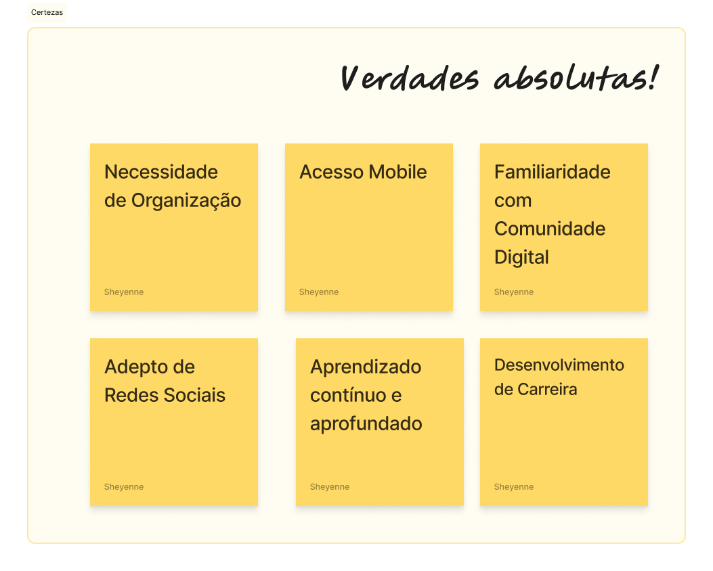
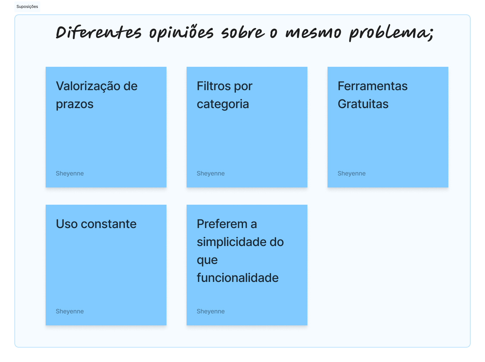
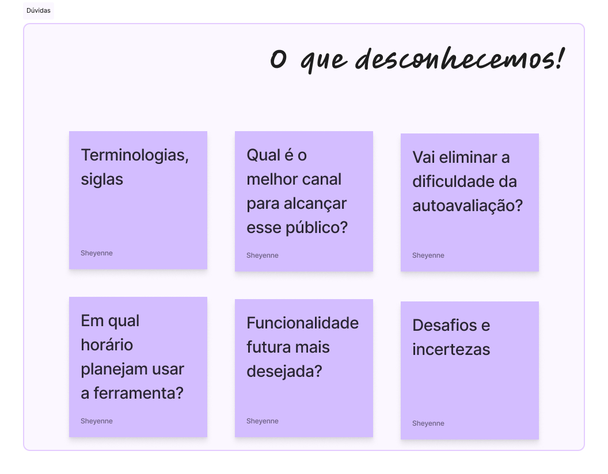

## 🚀 Repositório dedicado a Gameficação do Programa Desenvolve

✨ Desafio DEV: Código que conecta

## Briefing

Seu grupo é um squad de desenvolvimento contratado para construir um Módulo de Agendamento e Gestão de Tarefas (MVP) para uma nova plataforma de produtividade, a "Foco Total". O foco é aplicar boas práticas de programação, demonstrar codificação colaborativa eficaz e garantir a integridade dos dados através da integração com um banco de dados.

## 🧩 Tema

Módulo MVP da "Foco Total"

## Ferramenta - > AGILE TASK

## 📚 O objetivo principal

Avaliar a capacidade de um grupo de desenvolvimento de entregar um produto de software funcional (MVP), aplicando boas práticas de arquitetura e qualidade de código, e demonstrando habilidade de planejamento e colaboração em equipe sob restrição de tempo.

## Requisitos Básicos
Gerenciar Tarefas e Usuários

## 💻 Requisitos Funcionais Mínimos (MVP):


```
Cadastro de Usuário com Login (CARLOS):
Registro (Cadastro): Nome, E-mail (único), Senha (criptografada).
Login: Autenticação do usuário pelo E-mail e Senha.

Inserção de Dados (Tarefas) (IAGO):
Permitir que um usuário logado crie uma nova tarefa (Título, Descrição, Data de Vencimento, Status - Ex: 'Pendente' / 'Concluída').
A tarefa deve estar vinculada ao ID do Usuário que a criou.

Busca e Listagem de Tarefas(ARIANA):
Listagem: Permitir que o usuário logado visualize todas as suas tarefas.
Busca: Funcionalidade para buscar tarefas por título ou status.

Atualização de Tarefas(SHEY):
Permitir que o usuário logado edite os detalhes de suas tarefas (Descrição, Data de Vencimento, Status).

Exclusão de Tarefas (BIA):
Permitir que o usuário logado exclua suas tarefas
```

## 💻 Quais as principais funcionalidades?


Perfil de Usuário

Timeline com rank de skills mais populares entre os usuários

Destaque do usuário mais dedicado do mês

Sugestão personalizada de novas habilidades ou cursos na aba destaque do site, através de 3 cards


## ⭐Tarefas

Criação, visualização, busca, edição, exclusão de tarefas: Título, Descrição, Data de Vencimento, Status - Ex: 'Pendente' / 'Concluída').


Listas priorizada por prazos: exibir tarefas ordenadas automaticamente pela Data De Vencimento, com as tarefas mais próximas do prazo em destaque (cores ou ícones).


Criação Ultra-Rápida de Tarefa: exigir apenas o Título e o Prazo inicialmente. A descrição e outros detalhes podem ser adicionados depois. Isso facilita o registro imediato, transformando o "Foco Total" em um "capturador" de tarefas.


Visualização de Status Simples: O usuário deve sentir satisfação ao arrastar ou clicar para mudar o status de "Pendente" para "Concluída" e ver a tarefa sair da lista principal, reforçando o hábito positivo.


Filtro Avançado: Adicionar um campo de "Disciplina" (ou Tag) na criação da tarefa. A Busca deve ter filtros rápidos por essa "Disciplina/Tag" e por Status, permitindo ao estudante isolar o trabalho em uma matéria específica.
Modo Escuro


## 🌟além dos mínimos básicos (CRUD) 

Lembretes (Notificações Push): Funcionalidade de alerta. Permite ao estudante receber alertas automáticos (na véspera ou no dia) sobre tarefas com Data de Vencimento próxima. Isso é crucial para um público que vive sob pressão de prazo. Transforma a ferramenta de uma simples lista em um assistente proativo contra a perda de prazo. Se a funcionalidade de Lembretes for implementada, TAREFA deverá incluir um novo atributo:
data_lembrete: (Optional) A data e hora em que o sistema deve disparar a notificação para o usuário.

Prioridade (ex: Baixa, Média, Alta): Atendendo ao requisito de Inserção de Dados. Adicionar um campo opcional de Prioridade para ajudar o estudante a aplicar o princípio de Urgente/Importante.

Reorganização Manual (Drag & Drop): Embora a ordenação por prazo seja a regra, permitir que o usuário reorganize manualmente a ordem das tarefas na lista (arrastar e soltar) dá a ele uma sensação de controle sobre a sua rotina, algo que valorizam.

Contagem de Tarefas Concluídas: Exibir um contador simples na dashboard: "Você concluiu 5 tarefas esta semana!" ou "Restam 3 tarefas urgentes." Isso alimenta a métrica de Taxa de Conclusão e a sensação de progresso.

## 📖 Critérios de Avaliação

Qualidade e clareza do código-fonte.

Organização e cooperação do time de desenvolvimento.

Cumprimento dos requisitos funcionais propostos.

Qualidade da documentação e explicação da arquitetura.


## 💡 Público-alvo

Estudantes Universitários (Foco em Gerenciamento de estudos)


## 💡 Problemática

Falha no gerenciamento do planejamento diário

## 💡 Quais as possíveis soluções?


Democratizar o conhecimento em tecnologias, com oportunidades de desenvolvimento pessoal e profissional, com foco em gerenciamento de estudos, conectando talentos.

# 📖 Matriz CSD






