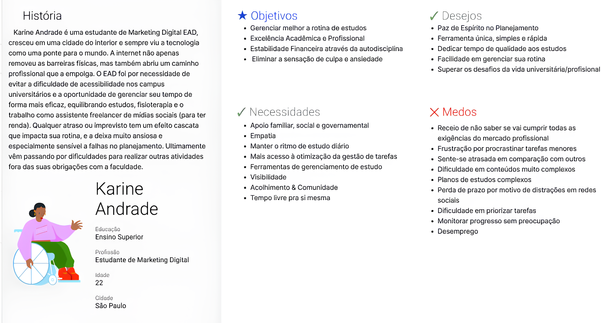
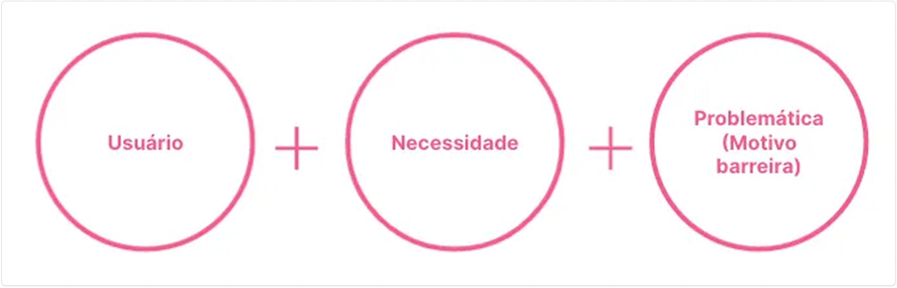

## 🚀 Repositório dedicado a Gameficação do Programa Desenvolve

✨ Desafio DEV: Código que conecta

🗓️ Período: 10 de novembro a 17 de novembro

🧑🏽‍💻 Equipe 4: Carlos, Iago, Ariana, Sheyenne, Beatriz
>  AGILE TASK


## Briefing

Seu grupo é um squad de desenvolvimento contratado para construir um **Módulo de Agendamento e Gestão de Tarefas (MVP)** para uma nova plataforma de produtividade, a **"Foco Total".** O foco é aplicar boas práticas de programação, demonstrar codificação colaborativa eficaz e garantir a integridade dos dados através da integração com um banco de dados.

## 🧩 Tema

Módulo MVP da "Foco Total"


## 📚 O objetivo principal

Avaliar a capacidade de um grupo de desenvolvimento de entregar um produto de software funcional (MVP), aplicando boas práticas de arquitetura e qualidade de código, e demonstrando habilidade de planejamento e colaboração em equipe sob restrição de tempo.

## Requisitos Básicos
Gerenciar Tarefas e Usuários

## 💻 Requisitos Funcionais Mínimos (MVP):


```
Cadastro de Usuário com Login (CARLOS):
Registro (Cadastro): Nome, E-mail (único), Senha (criptografada).
Login: Autenticação do usuário pelo E-mail e Senha.

Inserção de Dados (Tarefas) (IAGO):
Permitir que um usuário logado crie uma nova tarefa (Título, Descrição, Data de Vencimento, Status - Ex: 'Pendente' / 'Concluída').
A tarefa deve estar vinculada ao ID do Usuário que a criou.

Busca e Listagem de Tarefas(ARIANA):
Listagem: Permitir que o usuário logado visualize todas as suas tarefas.
Busca: Funcionalidade para buscar tarefas por título ou status.

Atualização de Tarefas(SHEY):
Permitir que o usuário logado edite os detalhes de suas tarefas (Descrição, Data de Vencimento, Status).

Exclusão de Tarefas (BIA):
Permitir que o usuário logado exclua suas tarefas
```

## 💻 Quais as principais funcionalidades?


- Perfil de Usuário

- Ranking de Usuários

- Gestão de Tarefas

- Conquistas e Recompensas

- Análise de progresso


## ⭐Tarefas

- **Criação, visualização, busca, edição, exclusão de tarefas:** Título, Descrição, Data de Vencimento, Status - Ex: 'Pendente' / 'Concluída').


- **Listas priorizada por prazos:** exibir tarefas ordenadas automaticamente pela Data De Vencimento, com as tarefas mais próximas do prazo em destaque (cores ou ícones).


- **Criação Ultra-Rápida de Tarefa:** exigir apenas o Título e o Prazo inicialmente. A descrição e outros detalhes podem ser adicionados depois. Isso facilita o registro imediato, transformando o "Foco Total" em um "capturador" de tarefas.


- **Visualização de Status Simples:** O usuário deve sentir satisfação ao arrastar ou clicar para mudar o status de "Pendente" para "Concluída" e ver a tarefa sair da lista principal, reforçando o hábito positivo.


- **Filtro Avançado:** Adicionar um campo de "Disciplina" (ou Tag) na criação da tarefa. A Busca deve ter filtros rápidos por essa "Disciplina/Tag" e por Status, permitindo ao estudante isolar o trabalho em uma matéria específica.
Modo Escuro


## 🌟fazendo além dos mínimos básicos (CRUD) exigidos:

- **Prioridade (ex: Baixa, Média, Alta):** Atendendo ao requisito de Inserção de Dados. Adicionar um campo opcional de Prioridade para ajudar o estudante a aplicar o princípio de Urgente/Importante.

- **Contagem de Tarefas Concluídas:** Exibir um contador simples na dashboard: "Você concluiu 5 tarefas esta semana!" ou "Restam 3 tarefas urgentes." Isso alimenta a métrica de Taxa de Conclusão e a sensação de progresso.

## 💡Upgrades futuros

- **Lembretes (Notificações Push):** Funcionalidade de alerta. Permite ao estudante receber alertas automáticos (na véspera ou no dia) sobre tarefas com Data de Vencimento próxima. Isso é crucial para um público que vive sob pressão de prazo. Transforma a ferramenta de uma simples lista em um assistente proativo contra a perda de prazo. Se a funcionalidade de Lembretes for implementada, TAREFA deverá incluir um novo atributo:
data_lembrete: (Optional) A data e hora em que o sistema deve disparar a notificação para o usuário.

- **Reorganização Manual (Drag & Drop):** Embora a ordenação por prazo seja a regra, permitir que o usuário reorganize manualmente a ordem das tarefas na lista (arrastar e soltar) dá a ele uma sensação de controle sobre a sua rotina, algo que valorizam.


## 📖 Critérios de Avaliação

- Qualidade e clareza do código-fonte.

- Organização e cooperação do time de desenvolvimento.

- Cumprimento dos requisitos funcionais propostos.

- Qualidade da documentação e explicação da arquitetura.


## 💡 Público-alvo

Estudantes (Foco em Gerenciamento de estudos)


## 💡 Problemática

Falha no gerenciamento do planejamento diário

## 💡 Quais as possíveis soluções?

Democratizar o conhecimento em tecnologias, com oportunidades de desenvolvimento pessoal e profissional, com foco em gerenciamento de estudos, conectando talentos.

> Plataforma de Gerenciamento de Estudos


## 💡 Insights

➡️Dores identificadas?
-
As pesquisas apontam para um conjunto de frustrações e dificuldades emocionais e práticas:

- **Sobrecarga e Ansiedade:** A dificuldade em lidar com múltiplos prazos (provas, trabalhos, leituras) de diferentes disciplinas simultaneamente causa estresse e ansiedade.

- **Perda de Controle:** A falta de uma rotina organizada leva à sensação de que o tempo está sendo mal gerido e que o progresso está estagnado, resultando em insatisfação com a própria aprendizagem.

- **Procrastinação Frequente:** O adiamento não estratégico de tarefas, especialmente estudos diários, gera culpa e impede a progressão acadêmica, sendo um fenômeno muito comum.

- **Dificuldade de Autoavaliação:** Falta de mecanismos simples para monitorar e refletir se os objetivos de estudo estão sendo alcançados, ou seja, se a meta diária/semanal foi cumprida.


➡️Qual o contexto em que estão inseridos?
-
Alta demanda, autonomia e transição:

- **Ambiente Multifacetado:** Eles precisam equilibrar as exigências acadêmicas (aulas, pesquisas, trabalhos), pessoais (vida social, família, hobbies) e, muitas vezes, profissionais (estágios ou empregos).

- **Autonomia Forçada:** Ao contrário do ensino médio, a universidade exige um alto grau de autonomia e disciplina na gestão do tempo. Não há um controle constante sobre o estudo diário.

- **Vida Digital:** São usuários intensivos de tecnologia e valorizam soluções que sejam acessíveis, rápidas e que possam ser utilizadas em qualquer dispositivo (mobile).


➡️Quais os principais desafios enfrentados por esses usuários?
-
- **Priorização Efetiva:** Decidir qual tarefa (leitura, trabalho, resumo, preparo para prova) é a mais urgente e importante, dada a sobrecarga de demandas.
  
- **Consistência e Hábito:** Transformar o ato de planejar e organizar a agenda de estudos em um hábito diário e sustentável, em vez de apenas um esforço inicial no semestre.

- **Foco em Tarefas Pequenas:** Evitar procrastinar em relação às tarefas menores e diárias (como leituras obrigatórias ou exercícios) que são cruciais, mas menos assustadoras do que grandes projetos (o que o estudo apontou como sendo o que mais se procrastina).

- Integração de Informação: Centralizar todos os prazos e tarefas dispersos em diferentes fontes (e-mail, plataforma EAD, anotações de aula) em um único local de fácil acesso.


# 📖 Matriz CSD


## Persona


## A escolha da persona é feita através de entrevistas e questionários, mas devido ao tempo curto, pesquisamos qual o perfil de estudante, mas se beneficiaria com a proposta do projeto.




# 🛑Importante: 

## 🛠️ Ferramentas Utilizadas

- HTML
- Tailwind CSS
- REACT
- Node.js
- SQL

## 💻 Como executar o projeto

## 📦 Instalação de Dependências e Pacotes

- NPM
- JSX

## 🧩 Outras informações

## 🖼️ Prévia

Metodologias ágeis:  
👉[Trello](https://trello.com/invite/b/691291b757d0491d7e245873/ATTI68355fc7cebf7ca79f7306398a5cb25f98E55839/gameficacao)


